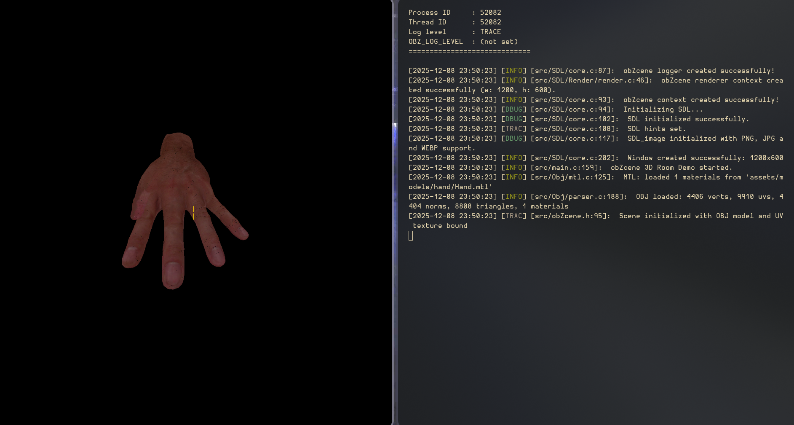

# The obZcene engine

A truly obscene piece of work.



WIP

## 0. Aim 

Possibly a super small but very powerful **Immediate mode** game engine (possibly).

## 1. Build

> [!NOTE]
> 
> Will run only on Linux!
> 
> (Only tested on X86 but should work on other archs too)
>

### 1.1 - Deps

- Make (GNU)
- SDL2 (SDL2 and SDL2_image)
- C23 standard compliant compiler (!! **MSVC** WON'T WORK !!)

**OPTIONAL**
- Bear (https://github.com/rizsotto/Bear) [for generating compilation database for clang tooling]

```bash 
make
```

### 1.2 Build options

1. `BUILD`: Can build target as release or debug

2. `PREFIX`: For global installation directory (**NOT RECOMMENDED**)

3. `JOBS`: How many threads to run to compile the project

4. `VERBOSE`: Add more verbosity by printing compilation commands and other details to stdout while compiling

Example run:

```bash 
make BUILD=debug JOBS=8 VERBOSE=1
```

### 2. Development

Read [DEV.md](https://github.com/nots1dd/obZcene/blob/dev/docs/DEV.md) for more regarding the contribution guidelines / dev stuff.

### 3. LICENSE

This project is licensed under BSD 3 Clause [LICENSE](https://github.com/nots1dd/obZcene/blob/dev/LICENSE)
